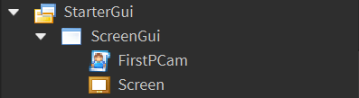
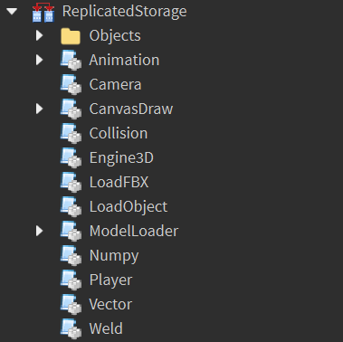
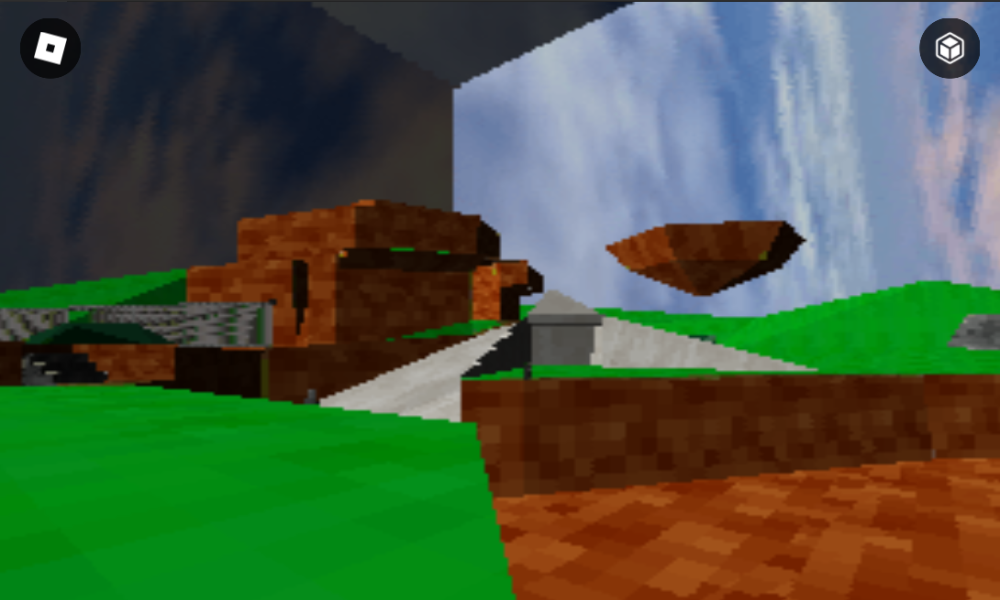

# Roblox-3D-Engine
A satisfactory 3D Engine that works for roblox.\
Check the latest release.

## Features
- Object File loading
- Textures
- View Plane Clipping
- Z Depth Buffer
- Support for CFrame Matrices
- Model functions like moving, rotating and sizing
- And much more!

## How To Use
First, you need to set up a ScreenGui, a LocalScript, and a Frame that acts as a screen for CanvasDraw to draw on.\
\
Once you have that, make sure to place all the modules inside ReplicatedStorage.\
\
Then, inside the LocalScript, paste in some example code that is found below to try it out! When you have the engine and its code all set up, you can use WASD to move and the mouse to rotate your camera.
- For the engine to read an object, it needs to be in a certain structure. You can find an example of this structure inside [Objects/Cube.lua]. The object needs to only contain triangles and also needs to have a texture. To create a texture and save it, use the [CanvasDraw Image Importer] and set the texture in the object to the name of the newly created folder.
> Note: Textures can only be at max 256x256 pixels. This also includes the screen size.

# Using The Tools
For the ModelLoader Module, you can add new models to the scene by using the ``ModelLoader.LoadFromName(Name)`` function. Pass in an object name that is in the `Objects` folder, and it creates a new model which you can edit in real time. Once you have a new Model, you can do whatever you want with it! Heres some examples:
```lua
-- Making a cube and performing translations
local Engine3D = require(game.ReplicatedStorage.Engine3D)
local ModelLoader = require(game.ReplicatedStorage.ModelLoader)
local CameraModule = require(game.ReplicatedStorage.Camera)

local Camera = CameraModule.new(Vector3.new(0,5,0), Vector3.zero, 1/50, "Freecam")
local World = Engine3D.new(script.Parent.Screen, Vector2.new(128,128), Camera, 70, 1000, false)

local Cube = ModelLoader.LoadFromName("Cube")
Cube.Size = Vector3.new(5,5,5)
Cube:SetColor(255, 0, 0)

game:GetService("RunService").RenderStepped:Connect(function()
	Cube.CFrame = Cube.CFrame * CFrame.Angles(math.rad(1), 0, 0)
	Camera:Update()
	World:Update()
end)
```
```lua
-- Using the Weld module to create joints
local Engine3D = require(game.ReplicatedStorage.Engine3D)
local ModelLoader = require(game.ReplicatedStorage.ModelLoader)
local CameraModule = require(game.ReplicatedStorage.Camera)
local WeldModule = require(game.ReplicatedStorage.Weld)

local Camera = CameraModule.new(Vector3.new(0,5,0), Vector3.zero, 1/50, "Freecam")
local World = Engine3D.new(script.Parent.Screen, Vector2.new(128,128), Camera, 70, 1000, false)

local Torso = ModelLoader.LoadFromName("Cube")
local Arm = ModelLoader.LoadFromName("Cube")

Torso.Size = Vector3.new(2,2,1)
Arm.Size = Vector3.new(1,2,1)

local Joint = WeldModule.new("Shoulder", Torso, Arm, CFrame.new(0,0,0), CFrame.new(0,0,0))

game:GetService("RunService").RenderStepped:Connect(function()
	Joint.C0 = Joint.C0 * CFrame.Angles(math.rad(1), 0, 0)
	Camera:Update()
	World:Update()
	WeldModule:Update()
end)
```
```lua
-- Making a music visualizer using roblox sounds!
local Engine3D = require(game.ReplicatedStorage.Engine3D)
local ModelLoader = require(game.ReplicatedStorage.ModelLoader)
local CameraModule = require(game.ReplicatedStorage.Camera)

local Camera = CameraModule.new(Vector3.new(0,5,0), Vector3.zero, 1/50, "Freecam")
local World = Engine3D.new(script.Parent.Screen, Vector2.new(128,128), Camera, 70, 1000, false)

local Sound = workspace.Sound
local Cube = ModelLoader.LoadFromName("Cube")

game:GetService("RunService").RenderStepped:Connect(function()
	Cube.Size = Vector3.new(1, (Sound.PlaybackLoudness/100) + 0.1, 1)
	Camera:Update()
	World:Update()
end)
```

## Other Information
To draw to the screen on Roblox, my engine uses the [CanvasDraw] module. I do not own this module, and it is only as optimized as the creator made it to be.
This also uses ported code from Python which this guy made: https://www.youtube.com/c/@FinFet.
I will probably be updating this repository to fix other bugs or use other methods. If you are using this, __please credit me__.
> Note: This engine is not perfect, it still needs to be optimized more. Large amounts of triangles impact performance, and so does a lot of colors at once.



[CanvasDraw]: <https://devforum.roblox.com/t/canvasdraw-a-powerful-pixel-based-graphics-engine-draw-pixels-lines-triangles-read-png-image-data-and-much-more/1624633>
[CanvasDraw Image Importer]: <https://create.roblox.com/marketplace/asset/8580432843/CanvasDraw-Image-Importer>
[Objects/Cube.lua]: <https://github.com/OrangeCash090/Roblox-3D-Engine/blob/main/Objects/Cube.lua>
