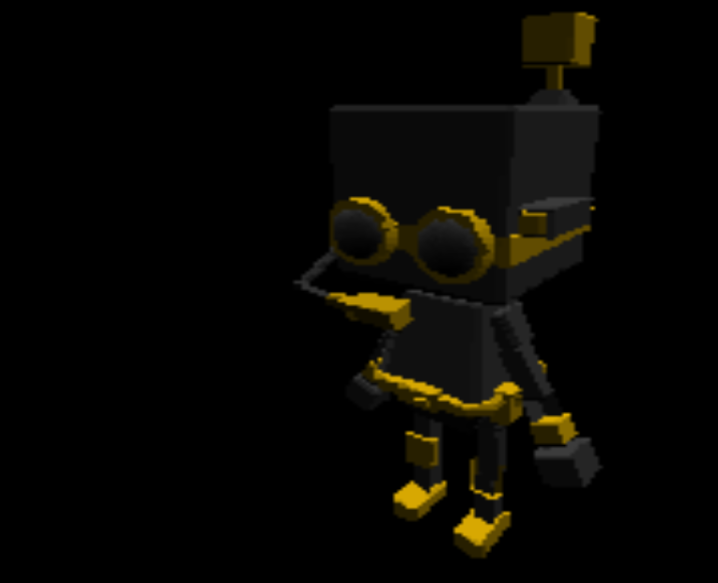

# Roblox-3D-Engine
A satisfactory 3D Engine that works for roblox.

## Features
- Object File loading
- Textures
- View Plane Clipping
- Z Depth Buffer
- Support for CFrame Matrices
- Model functions like moving, rotating and sizing
- And much more!

## How To Use
Just require the key modules like the Engine3D module, Camera modules, and ModelLoader module.
Make sure to use this on the client because that is what it is designed for.
- For the engine to read an object, it needs to be in a certain structure. The object needs to only contain triangles and also needs to have a texture. To create a texture and save it, use the [CanvasDraw Image Importer] and set the texture in the object to the name of the newly created folder.
> Note: Textures can only be at max 256x256 pixels. This also includes the screen size.

## Other Information
To draw to the screen on Roblox, my engine uses the [CanvasDraw] module. I do not own this module, and it is only as optimized as the creator made it to be.
This also uses ported code from Python which this guy made: https://www.youtube.com/c/@FinFet.
I will probably be updating this repository to fix other bugs or use other methods. If you are using this, __please credit me__.
> Note: This engine is not perfect, it still needs to be optimized more. Large amounts of triangles impact performance, and so does a lot of colors at once.

- el gato

[CanvasDraw]: <https://devforum.roblox.com/t/canvasdraw-a-powerful-pixel-based-graphics-engine-draw-pixels-lines-triangles-read-png-image-data-and-much-more/1624633>
[CanvasDraw Image Importer]: <https://create.roblox.com/marketplace/asset/8580432843/CanvasDraw-Image-Importer>
